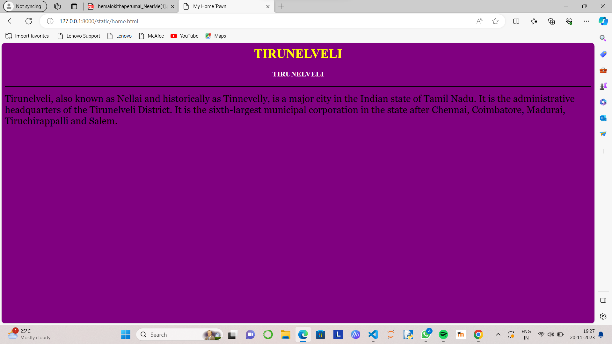

# Ex04 Places Around Me
## Date: 20.11.2023

## AIM
To develop a website to display details about the places around my house.

## DESIGN STEPS

### STEP 1
Create a Django admin interface.

### STEP 2
Download your city map from Google.

### STEP 3
Using ```<map>``` tag name the map.

### STEP 4
Create clickable regions in the image using ```<area>``` tag.

### STEP 5
Write HTML programs for all the regions identified.

### STEP 6
Execute the programs and publish them.

## CODE
```
map.html
 <html>
 <head>
 <title>My City</title>   
 </head>
 <body>
 <h1 align="center">
 <font color="blue"><b>TIRUNELVELI</b></font>   
 </h1>
 <h3 align="center">
 <font color="violet"><b>AHALYA S (23002896)</b></font>   
 </h3>
 <center>
 
 <map name="MyCity">
 <area shape="rect" coords="700,250,850,400" href="home.html" title="My Home Town">
 <area shape="circle" coords="950,240,40" href="valanadu.html" title="valanadu">
 <area shape="circle" coords="490,210,60" href="abishekapatti.html" title="abishekapatti">
 <area shape="circle" coords="500,250,40" href="pettai.html" title="pettai">
 <area shape="circle" coords="150,320,100" href="mukkudal.html" title="mukkudal">
 </map>   
 </center>   
 </body>
 </html>

 home.html
 <html>
    <head>
        <title>My Home Town</title>
    </head>
<body bgcolor="purple">
<h1 align="center">
    <font color="yellow"><b>THIRUNELVELI</b></font>
</h1>
   <h3 align="center">
    <font color="white"><b>THIRUNELVELI</b></font>
   </h3>
<hr color="black" size="3">
<p align=""justify">
<font face="Georgia" size="5">
    Tirunelveli  also known as Nellai and historically (during British rule) as Tinnevelly, is a major city in the Indian state of Tamil Nadu. It is the administrative headquarters of the Tirunelveli District. It is the sixth-largest municipal corporation in the state after Chennai, Coimbatore, Madurai, Tiruchirappalli and Salem. Tirunelveli is located 624 km (388 mi) southwest of the state capital Chennai, 58 km (36 mi) away from Thoothukudi, and 73 km (45 mi) from Kanyakumari. The downtown is located on the west bank of the Thamirabarani River; its twin Palayamkottai is on the east bank. Palayamkottai is called the Oxford of South India as it has many schools and colleges.[citation needed] It has several important government offices.
</font></p>
</body>
</html>

mukkudal.html
<html>
    <head>
        <title>My Home Town</title>
    </head>
<body bgcolor="purple">
<h1 align="center">
    <font color="yellow"><b>THIRUNELVELI</b></font>
</h1>
   <h3 align="center">
    <font color="white"><b>MUKUDAL</b></font>
   </h3>
<hr color="black" size="3">
<p align=""justify">
<font face="Georgia" size="5">
    Mukkudal Town is situated at Tirunelveli District. This is a Selection Grade Town Panchayat having population about of 14983. The three rivers Rama, Kadana and Thamirabarani River or mixing together in this town and so its named as Mukkudal.

</font></p>
</body>
</html>

pettai.html
<html>
    <head>
        <title>My Home Town</title>
    </head>
<body bgcolor="purple">
<h1 align="center">
    <font color="yellow"><b>THIRUNELVELI</b></font>
</h1>
   <h3 align="center">
    <font color="white"><b>PETTAIMUKUDAL</b></font>
   </h3>
<hr color="black" size="3">
<p align=""justify">
<font face="Georgia" size="5">
    Mukkudal Town is situated at Tirunelveli District. This is a Selection Grade Town Panchayat having population about of 14983. The three rivers Rama, Kadana and Thamirabarani River or mixing together in this town and so its named as Mukkudal.

</font></p>
</body>
</html>

valanadu.html
<html>
    <head>
        <title>My Home Town</title>
    </head>
<body bgcolor="purple">
<h1 align="center">
    <font color="yellow"><b>VALANADU</b></font>
</h1>
   <h3 align="center">
    <font color="white"><b>VALANADU</b></font>
   </h3>
<hr color="black" size="3">
<p align=""justify">
<font face="Georgia" size="5">
    Valanadu village is located in Manapparai taluka of Tiruchirappalli district in Tamil Nadu, India. It is situated 20km away from sub-district headquarter Manapparai (tehsildar office) and 50km away from district headquarter Tiruchirappalli.
</font></p>
</body>
</html>

abishekapatti.html
<html>
    <head>
        <title>My Home Town</title>
    </head>
<body bgcolor="purple">
<h1 align="center">
    <font color="yellow"><b>VALANADU</b></font>
</h1>
   <h3 align="center">
    <font color="white"><b>VALANADU</b></font>
   </h3>
<hr color="black" size="3">
<p align=""justify">
<font face="Georgia" size="5">
    Valanadu village is located in Manapparai taluka of Tiruchirappalli district in Tamil Nadu, India. It is situated 20km away from sub-district headquarter Manapparai (tehsildar office) and 50km away from district headquarter Tiruchirappalli.
</font></p>
</body>
</html>
```
## OUTPUT





## RESULT
The program for implementing image maps using HTML is executed successfully.
